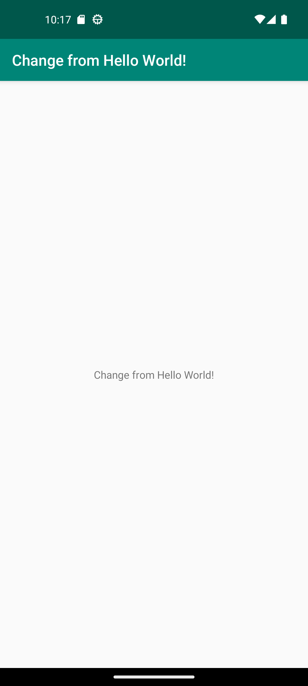

# Rapport

Changed the resource app_name. There are references to app_name in the AndroidManifest.xml labels.
Those labels are displayed in the app.

> ```<string name="app_name">Change from Hello World!</string>```


